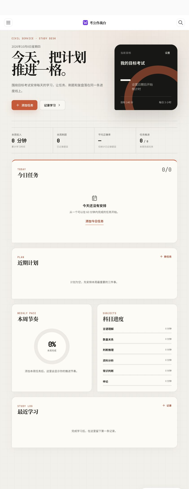

# Civil Service Exam Preparation Hub

一套面向公务员考试的本地工作台，中文名称为“考公作战台”。

它主要用于管理考试公告、报名时间、岗位信息和备考资料，让容易错过的时间节点、分散在不同渠道的职位表和本地文件集中到一个界面中。学习打卡是辅助能力，不是项目的核心目标。



## 在线体验

[打开 GitHub Pages 加密分享版](https://zhaoyihui78.github.io/Civil-Service-Exam-Preparation-Hub/)

在线版需要输入页面所有者提供的共享密钥。岗位雷达、时政热点、课程与书架、知识库及书架中的原始 PDF 会以加密快照发布，浏览器在输入正确密钥后才会解密；个人计划、阅读笔记和本机路径不会进入分享快照。在线版为只读模式，新增岗位、导入职位表和编辑资料仍需在本机工作台完成。

## 当前功能

### 岗位雷达

- 按国考、省考、选调生、事业单位等考试类型筛选。
- 按省份、城市和区县进行两级筛选。
- 支持分页浏览岗位，不使用冗长的纵向卡片列表。
- 可以手动新增岗位，保留公告或职位详情 URL。
- 支持导入 XLS、XLSX、CSV 官方职位表。
- 可根据专业、学历、政治面貌、毕业年份和目标地区进行本地初筛。
- 岗位信息始终以当年度官方公告和职位表为最终依据。

### 考试与时间节点

- 记录目标考试、考试日期和重要安排。
- 管理报名、资格审查、缴费、准考证打印和考试等节点。
- 在总览中查看临近事项与任务状态。
- 个人计划和岗位数据保存在本地 Vault，不写入前端代码。

### 课程与书架

- 将 Markdown 课程按书籍、版本和章节组织。
- 保存上次阅读章节与阅读进度。
- 支持在网站内部阅读本地 PDF。
- PDF 阅读器支持翻页、页码跳转、缩放、全屏和下载。
- 本机模式直接读取 Vault 中的 PDF；分享版只传输 AES-GCM 加密后的 PDF，并在浏览器内解密渲染。

### 备考资料与知识库

- 管理行测、申论、面试、时政和马克思主义相关资料。
- 支持本地 Markdown 阅读、笔记、引用和知识沉淀。
- 提供考公知识库与知识关系图。
- 示例知识包括行测方法、申论框架、报考核验和马克思主义理论转化。

### 时政热点

- 展示与公考相关的时政信息。
- 支持主动刷新，并保留上一次有效结果作为失败回退。
- 外部信息只作备考线索，重要事实仍需回到官方来源核验。

## 技术栈

- React 19
- Vite 6
- Node.js 本地服务
- PDF.js
- React Router
- Motion、GSAP
- Markdown / Obsidian 风格 Vault
- Node.js Test Runner

## 快速启动

需要 Node.js 20 或更高版本。

### macOS

可以双击根目录中的：

```text
启动考公工作台.command
```

### 终端启动

```bash
cd Workbench
npm install
npm run dev
```

随后访问：

```text
http://127.0.0.1:5173/
```

开发服务默认只监听本机回环地址，不应直接暴露到公网或局域网。

## 连接自己的私人知识库

仓库自带的 `个人知识库/` 是公开、安全的演示 Vault。真实资料建议放在仓库之外，避免误提交到 GitHub。

复制环境变量示例：

```bash
cd Workbench
cp .env.example .env
```

然后编辑 `Workbench/.env`：

```dotenv
PERSONAL_DASHBOARD_VAULT_ROOT=/你的/私人知识库/绝对路径
```

`.env` 已被 Git 忽略。

## 推荐的数据目录

```text
私人知识库/
├── 10_raw/
│   ├── books/
│   │   └── 书名/
│   │       ├── 原版/
│   │       │   └── 原书.pdf
│   │       ├── images/
│   │       └── 中文阅读版/
│   │           ├── 01-第一章.md
│   │           └── 02-第二章.md
│   ├── exam-aptitude/
│   ├── exam-essay/
│   ├── exam-interview/
│   ├── exam-current-affairs/
│   └── exam-marxism/
├── 20_exam/
└── wiki/
    ├── concepts/
    └── frameworks/
```

只要书籍目录中存在可识别的 Markdown 章节，工作台就会建立书架；同一书籍目录中的 PDF 会成为站内原版阅读入口。

## 私人数据边界

以下内容不会被提交到仓库：

- `Workbench/.env`
- 私人 Vault 的绝对路径
- 本地考试计划运行数据
- 私人 Vault 的明文资料与原始 PDF
- 阅读笔记和 AI 阅读解释缓存
- `node_modules/` 与构建产物

公开仓库中的知识文章和示例数据均用于展示目录契约，不代表真实用户资料。线上分享所需的岗位、资料和 PDF 只作为加密 Release 资产发布，不进入 Git 历史；提交前建议运行隐私检查：

```bash
cd Workbench
npm run privacy:scan
```

## 开发与验证

```bash
cd Workbench
npm test
npm run build
npm run privacy:scan
```

## 项目结构

```text
Civil-Service-Exam-Preparation-Hub/
├── Workbench/                  # 前端、服务端、测试与构建脚本
├── 个人知识库/                 # 公开演示 Vault
├── 启动考公工作台.command       # macOS 快速启动脚本
├── 考公工作台使用说明.md
└── README.md
```

## 许可证

本项目使用 MIT License，详见 [LICENSE](./LICENSE)。
